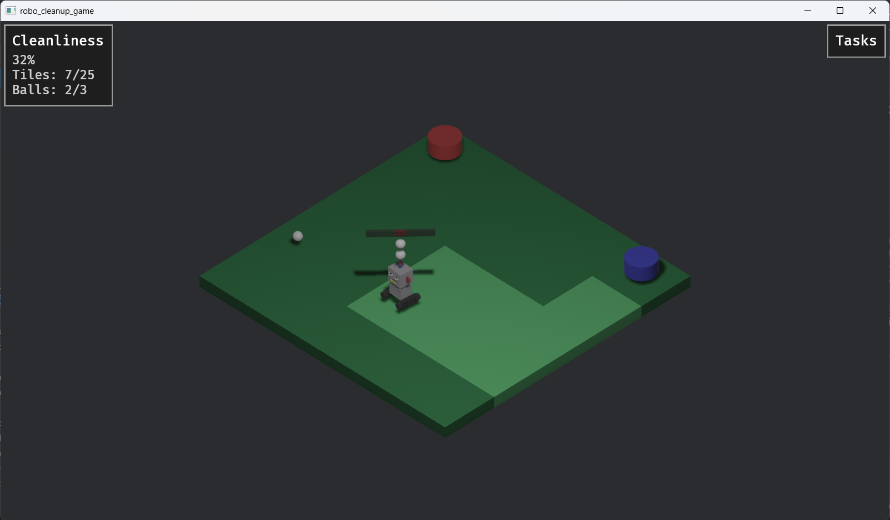

# Robo Cleanup Game

A tile-based cleanup simulation game built with Bevy, featuring autonomous robot navigation, battery management, and task scheduling.



## Overview

Control a robot to clean tiles and collect balls on a 5x5 grid. The robot navigates autonomously using A* pathfinding, manages its battery level, and executes queued tasks in sequence. Watch as the robot methodically cleans the environment while monitoring its power consumption.

## Features

- **Autonomous Navigation**: Click tiles or objects to queue waypoints; the robot calculates optimal paths using A* pathfinding
- **Task Management**: Queue multiple tasks (movement, ball pickup, disposal) that execute sequentially
- **Battery System**: Battery depletes based on distance traveled (10% per unit); robot automatically returns to charging station when depleted
- **Cleanliness Tracking**: Monitor overall progress as tiles are cleaned and balls are collected
- **Interactive UI**: Click waypoint buttons to remove tasks from the queue
- **Visual Feedback**: Tiles change color when cleaned, objects highlight when clicked

## Gameplay Mechanics

### Controls

- **Left Click on Tile**: Add a movement waypoint to that location
- **Left Click on Ball**: Queue a pickup task for that ball
- **Left Click on Drop Zone**: Queue a disposal task (drops all carried balls)
- **Left Click on Waypoint Button**: Remove that task from the queue

### Game Elements

- **Green Tiles**: Start dirty (dark green), become lighter when the robot passes over them
- **Yellow Balls**: Three balls spawn on the field; click to collect them
- **Red Drop Zone**: Located at grid position (-2, -2); dispose of collected balls here
- **Blue Charging Station**: Located at grid position (2, -2); robot returns here automatically when battery is low
- **3D Battery Bar**: Floats above the robot, color-coded (green/orange/red) based on charge level

### Task Types

1. **Move To**: Robot navigates to the specified tile and waits for 2 seconds
2. **Pick Up**: Robot navigates to a ball's location and collects it (balls float above the robot)
3. **Drop Away**: Robot navigates to the drop zone and releases all carried balls

### Battery Management

- Battery starts at 100% and depletes at 10% per grid unit traveled
- When battery reaches 0%, all queued tasks are cleared and the robot returns to the charging station
- Charging takes 5 seconds to reach full capacity
- Battery bar changes color: green (>50%), orange (25-50%), red (<25%), yellow (charging)

## Build Instructions

### Recommended: pixi (self-contained environment)

[pixi](https://pixi.sh) manages the Rust toolchain and all system dependencies inside an isolated environment — no manual `rustup` or system package installation needed.

1. [Install pixi](https://pixi.sh/latest/#installation) (one-liner installer).

2. Clone and enter the repository:
```bash
git clone <repository-url>
cd robo_cleanup_game
```

3. Install all dependencies and run:
```bash
pixi run run           # debug build
pixi run run-release   # optimised build
```

Other available tasks:
```bash
pixi run build          # compile only (debug)
pixi run build-release  # compile only (release)
pixi run clean          # remove build artefacts
```

#### WebAssembly / itch.io

Requires [rustup](https://rustup.rs) installed. First-time setup (downloads `wasm-bindgen-cli` and `wasm-server-runner`):
```bash
pixi run setup-wasm
```

Dev — opens the game live in the browser:
```bash
pixi run run-wasm
```

Build and zip for itch.io upload:
```bash
pixi run zip-wasm
```

This produces `robo_cleanup_game_web.zip`. To publish on itch.io:
1. Upload the zip file
2. Set **Kind of project** to **HTML**
3. Tick **This file will be played in the browser**
4. Set **Viewport dimensions** to **640 × 360**
5. Save & publish

> **Linux note:** Bevy requires a Vulkan- or OpenGL-capable GPU driver and a running display server (X11 or Wayland) at runtime. Those are provided by the host system; pixi installs the build-time libraries (ALSA, XKB, Wayland client, X11, Mesa, eudev).
>
> **macOS note:** Xcode Command Line Tools must be installed (`xcode-select --install`) as Bevy uses the system Metal framework.

---

### Manual build (requires rustup)

#### Prerequisites

- Rust (1.85 or later)
- Cargo (comes with Rust)

### Installation

1. Clone the repository:
```bash
git clone <repository-url>
cd robo_cleanup_game
```

2. Build the project:
```bash
cargo build --release
```

The compiled binary will be located at `target/release/robo_cleanup_game.exe` (Windows) or `target/release/robo_cleanup_game` (Linux/macOS).

## Running the Game

### Development Mode

Run with cargo for faster iteration (debug mode):
```bash
cargo run
```

### Release Mode

For better performance, run the optimized build:
```bash
cargo run --release
```

Or run the compiled binary directly:
```bash
./target/release/robo_cleanup_game
```

## Project Structure

```
robo_cleanup_game/
├── src/
│   └── main.rs           # Main game logic (ECS systems, pathfinding, UI)
├── Cargo.toml            # Project dependencies
├── robot.glb             # 3D robot model asset
└── screenshot.png        # Game screenshot
```

## Technical Details

- **Engine**: Bevy 0.17.3
- **Rendering**: 3D with orthographic isometric camera view
- **Pathfinding**: A* algorithm with Manhattan distance heuristic
- **Input Handling**: Mesh picking with observer pattern for click events
- **Architecture**: Entity Component System (ECS)

### Key Components

- `Robot`: Manages position, movement path, waypoint queue, battery level, and charging state
- `Tile`: Grid cells that can be cleaned
- `Ball`: Collectible objects that float above the robot when picked up
- `DropZone`: Disposal location for collected balls
- `ChargingStation`: Battery recharge location
- `Cleanliness`: Resource tracking cleaned tiles and collected balls

## Credits

Built with the Bevy game engine. Inspired by the alien-cake-addict example from the Bevy repository.

This game is made with assistence of Github Co-Pilot
